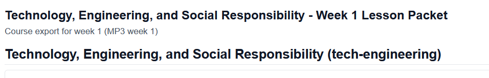

# Project Roadmap: Teacher Lesson Planning Portal

## ⚠️ SPECIFICATION DOCUMENT

**Status**: This is a SPECIFICATION (design plan) for a React app to be built, NOT documentation of an existing, implemented system.

**Current Reality**:
- 🔲 Code does not exist yet
- 🔲 Project has not been initialized
- 🔲 No package.json, React app, or deployed version exists

**Purpose**: This roadmap defines WHAT will be built, WHEN, and WHY. It serves as the spec for developers.

---

## Overview

This document outlines the complete roadmap for the Teacher Lesson Planning Portal, organized into three phases with clear deliverables, timelines, and priorities.

**Primary Goal**: Build a practical, teacher-first lesson planning system for managing 6 courses across a school year, starting from Marking Period 3 (Feb 2026).

---

## Phase 1: MVP (Target: Week of Feb 10-15, 2026)

### Status: 🔲 NOT YET STARTED (Planned to begin Feb 10, 2026)

### Priority: CRITICAL

This is the foundational phase. Everything built here will be reused in Phases 2 & 3.

### Features

#### 1.1 Dashboard & Navigation
- **Week-at-a-Glance View** - Teacher landing page showing next 5 school days
  - Shows all lessons planned for the week across all courses
  - Visual indicators: ✓ (taught), ⏳ (in progress), blank (planned)
  - Click any lesson to open editor
- **Course Navigation** - Dropdown/sidebar to switch between courses
- **Global Search** - Find lessons, materials, standards across all courses
- **Dark/Light Mode Toggle** - Teacher preference

#### 1.2 Lesson Planning Engine
- **Lesson Editor Component**
  - Create new lesson OR edit existing lesson
  - Fields:
    - Course (dropdown)
    - Unit (dropdown)
    - Date (date picker)
    - Title (text field)
    - Duration in minutes (number field)
    - Objectives (list, add/remove)
    - Agenda/Timeline (time-based breakdown)
    - NJ Standards (multi-select dropdown)
    - Materials/Resources (link PDFs, docs, etc.)
    - Assessment method (text field)
    - Homework (text field)
    - Teacher notes (free text)
  - Save/Cancel/Delete buttons
  - Preview mode (see formatted lesson plan)

- **Template System**
  - Pre-built templates: Lecture, Lab, Project-Based, Hands-On Activity, Discussion-Based
  - Teacher selects template → auto-fills structure → customizes
  - Templates stored in `/public/data/lesson-plan-templates.json`

#### 1.3 Standards Alignment
- **Standards Multi-Select** - Dropdown showing all NJ standards for that course
- **Standards Display** - Show which standards are covered in each unit
- **Quick-Tag Feature** - One-click add common standards per course

#### 1.4 Materials & Resources Linking
- **Attach Materials**
  - Upload/link PDFs
  - Link to Google Docs
  - Link to external resources
  - Add description for each material
- **Materials auto-linked to lessons** - Teacher sees what's available for that unit

#### 1.5 Progress Tracking
- **Lesson Status Indicator**
  - Planned (not yet taught)
  - In Progress (currently teaching)
  - Taught (completed)
  - Assessed (assessment complete)
- **Progress Summary** - Show % of lessons completed per course/unit
- **History View** - See all past lessons taught (readonly)

#### 1.6 Export & Print
- **Export to PDF** - Generate professional lesson plan PDF
  - Includes: objectives, standards, agenda, materials list, assessment
  - Formatted for printing
  - Can export single lesson or entire unit
- **Email/Share** - Option to email PDF to self or admin

#### 1.7 Data Persistence
- **localStorage** - Save lesson plans to browser
  - Syncs between browser tabs
  - Survives page refresh
  - NOT shared across devices (Phase 2: cloud sync)
- **Auto-save** - Lesson editor auto-saves every 30 seconds while typing

#### 1.8 Observation & Evaluation Tools
- **Admin Observation Guide** - Reference tool for teacher observations in NJ
  - Overview of NJ teacher evaluation requirements (TEACH-NJ Act)
  - Danielson Framework for Teaching (4 domains, 22 components)
  - What administrators observe during classroom visits
  - Rating system and point thresholds (Ineffective, Partially Effective, Effective, Highly Effective)
  - Pre-observation preparation checklist
  - During-observation best practices
  - Post-observation conference guidance
  - Key things to avoid and red flags
  - 2025-26 updates (SGO flexibility for tenured teachers)
  - Links to official NJ resources and NJEA union resources

- **Observation Readiness Checklist**
  - Pre-conference preparation guide
  - Room setup checklist
  - Lesson planning alignment to framework
  - Student engagement strategies
  - Questioning strategies (higher-order, wait time)
  - Classroom management quick tips

- **Observation Self-Assessment**
  - Rate yourself on Danielson domains
  - Identify strengths and growth areas
  - Generate personalized improvement tips
  - Compare your self-assessment to evaluator feedback

- **Resource Links**
  - [NJ Department of Education Educator Evaluation](https://www.nj.gov/education/edueval/index.shtml)
  - [AchieveNJ Program](https://www.nj.gov/education/AchieveNJ/)
  - [Danielson Framework Details](https://danielsongroup.org/the-framework-for-teaching/)
  - [NJEA Resources](https://www.njea.org/)
  - Your district's specific evaluation instrument

### Deliverables for Phase 1

```
🔲 Project initialized with React + Vite + Tailwind
🔲 /public/data/ structure created with seed courses data
🔲 nj-standards.json populated with standards
🔲 lesson-plan-templates.json with 5 default templates
🔲 Dashboard component (week view)
🔲 LessonEditor component (create/edit)
🔲 TemplateSelector component
🔲 StandardsAligner component
🔲 MaterialsLinker component
🔲 ProgressTracker component
🔲 PDF Export functionality
🔲 localStorage persistence
🔲 Full responsive design (mobile, tablet, desktop)
🔲 Observation Guide documentation (OBSERVATION_GUIDE.md)
🔲 Observation Tools page/section in React app
🔲 Admin observation checklist component
🔲 Self-assessment tool for Danielson framework
🔲 Deployed to Vercel
```

### Timeline: Phase 1

| Day | Focus | Deliverable |
|-----|-------|-------------|
| Mon 2/10 | Setup, Data Architecture | Project initialized, /public/data/ structure, courses.json, nj-standards.json |
| Tue 2/11 | Core Components | Dashboard, LessonEditor, TemplateSelector |
| Wed 2/12 | Features | StandardsAligner, MaterialsLinker, ProgressTracker |
| Thu 2/13 | Export & Polish | PDF export, styling, responsive design |
| Fri 2/14-15 | Testing & Deploy | QA, bug fixes, deploy to Vercel |

---

## Phase 2: Enhancements (Target: Weeks of Feb 17-28, 2026)

### Status: 🔲 PLANNED (Depends on Phase 1 completion)

### Priority: HIGH

### Features

#### 2.1 AI-Assisted Lesson Planning
- **Generate from Curriculum** - Teacher uploads/links curriculum doc
  - Backend calls ChatGPT/Gemini API to analyze
  - Returns structured lesson plans
  - Teacher reviews and fine-tunes in editor
- **Smart Suggestions** - System suggests next lessons based on pacing guide

#### 2.2 Pacing Guide Tool
- **Create Pacing Guide** - Teacher specifies:
  - Marking period dates
  - Number of instructional days available
  - Units to cover
  - System calculates recommended days per unit
- **Pacing Analysis** - Compare planned vs. actual progress
- **Adjustments** - Quickly reschedule lessons if behind/ahead

#### 2.3 Standards Dashboard
- **Standards Coverage Report**
  - Which standards are covered per marking period
  - Which standards need more lessons
  - Standards alignment heatmap
- **Compliance Tracking** - Ensure all required standards are taught

#### 2.4 Week-to-Week Recommendations
- **Smart Sequencing** - Based on lessons taught, suggest what's next
- **Standards Gaps** - Alert if standards not covered yet
- **Material Prep Reminders** - Remind teacher to gather materials 3 days before lesson

#### 2.5 Cloud Sync (Optional)
- **Firebase or Supabase** - Sync lesson plans across devices
- **Backup** - Automatic backups
- **Share with Admin** - Export reports for administrators

#### 2.6 Assessment Integration
- **Assessment Tracker** - Link assessments to lessons
- **Quiz/Test Linking** - Link lesson to quiz/test
- **Grade Tracking** (basic) - Simple grade input per lesson

### Deliverables for Phase 2

```
🔲 ChatGPT/Gemini integration for lesson generation
🔲 Pacing guide builder and analyzer
🔲 Standards coverage dashboard
🔲 Week recommendations engine
🔲 Assessment tracker
🔲 Cloud database setup (Firebase or Supabase)
🔲 Cloud sync functionality
🔲 Email notifications
```

### Timeline: Phase 2

| Week | Focus |
|------|-------|
| Feb 17-21 | AI integration, pacing guide tool |
| Feb 24-28 | Standards dashboard, cloud sync |

---

## Phase 3: Student Portal & Expansion (Target: March+, 2026)

### Status: 🔲 PLANNED (Depends on Phase 2 completion)

### Priority: MEDIUM

### Features

#### 3.1 Student-Facing Portal
- **Course View** (readonly)
  - Students see lessons, materials, assignments
  - Organized by unit
- **Assignment Tracker**
  - Due dates
  - Submission status
  - Grades (if applicable)
- **Resource Library**
  - Download materials
  - Access links
- **Calendar View** - When assignments are due

#### 3.2 Parent Portal
- **Progress Overview** - See child's progress in each course
- **Assignments & Grades**
- **Attendance** (if integrated)

#### 3.3 Admin Dashboard
- **Teacher Oversight**
  - See lesson plans across all teachers
  - Standards alignment verification
  - Compliance reporting
- **Curriculum Management** - Manage standards, curriculum docs
- **Reporting** - Standards coverage, pacing analysis across all courses

### Deliverables for Phase 3

```
🔲 Student dashboard
🔲 Assignment submissions (if needed)
🔲 Parent portal
🔲 Admin dashboard
🔲 Compliance reporting
```

---

## Priority Matrix

### Highest Priority (Must Have for MVP)
- Lesson editor (create/edit plans)
- Dashboard (week view)
- Templates (quick start)
- Standards tagging
- Export to PDF
- Progress tracking
- localStorage persistence

### High Priority (Nice to Have for MVP)
- Materials linking
- Full year calendar view
- Search functionality
- Dark mode

### Lower Priority (Phase 2+)
- AI lesson generation
- Cloud sync
- Advanced analytics
- Student portal

---

## Feature Dependencies

```
Phase 1: Core System
├── Dashboard (depends on data structure)
├── LessonEditor (depends on templates)
├── Templates (depends on data schema)
├── StandardsAligner (depends on nj-standards.json)
├── ProgressTracker (depends on localStorage)
└── PDF Export (depends on all above)

Phase 2: AI & Analytics
├── AI Lesson Gen (depends on ChatGPT/Gemini API setup)
├── Pacing Guide (depends on lesson data)
├── Standards Dashboard (depends on lesson data)
└── Cloud Sync (depends on Firebase/Supabase setup)

Phase 3: Student/Admin
├── Student Portal (depends on Phase 1 core)
├── Admin Dashboard (depends on Phase 2 analytics)
└── Parent Portal (depends on student data)
```

---

## Risks & Mitigations

| Risk | Impact | Mitigation |
|------|--------|-----------|
| Not enough time in Phase 1 | MVP incomplete | Cut features to absolute core; prioritize dashboard + editor |
| File-based data becomes too large | Performance issues | Migrate to database in Phase 2 if needed |
| Curriculum analysis takes too long | Delayed lesson generation | Use templates first, add AI later in Phase 2 |
| Teacher adoption low | Tool not used | Get early feedback, iterate quickly, make UI simple |
| NJ standards unclear | Wrong alignment | Reference official NJ standards docs, ask teacher for clarification |

---

## Success Criteria (Targets)

These are target outcomes used to determine completion once each phase is implemented.

### Phase 1 Success
- 🔲 Teacher can create lesson plans in < 2 minutes using template
- 🔲 Can view all lessons for the week in one place
- 🔲 Can tag lessons with NJ standards
- 🔲 Can export lesson plan as PDF
- 🔲 Lesson plans persist after browser refresh
- 🔲 Mobile-responsive and works on phone

### Phase 2 Success
- 🔲 AI can generate lesson plan from curriculum doc
- 🔲 Teacher can see standards coverage % per marking period
- 🔲 Pacing guide helps teacher stay on track
- 🔲 Lesson plans sync across devices

### Phase 3 Success
- 🔲 Students can see their coursework
- 🔲 Parents can see child's progress
- 🔲 Admin can verify standards compliance

---

## Maintenance & Updates

### Regular Updates Required
- **NJ Standards** - Update if standards change
- **Pacing Guides** - Update yearly with school calendar
- **Templates** - Add/modify as teaching style evolves
- **Bug Fixes** - Address issues as they arise

### Review Points
- **After Phase 1** (Feb 15): Is MVP meeting teacher needs?
- **After Phase 2** (Feb 28): Is AI helping? Are standards tracked correctly?
- **After Phase 3** (March 31): Full system working? Ready for next year?

---

## Notes for AI Models Updating This Roadmap

When making changes:

1. **Update the relevant phase section** - What features are affected?
2. **Update the timeline** - How does this change dates?
3. **Update the dependencies** - Does this feature depend on others?
4. **Update success criteria** - How will we know if this works?
5. **Document the rationale** - Why is this change being made?
6. **Link to architecture** - Reference [ARCHITECTURE.md](./ARCHITECTURE.md) if design changes

---

**Last Updated**: February 8, 2026
**Next Review**: February 15, 2026 (end of Phase 1)
**Maintainer**: AI Development Team
